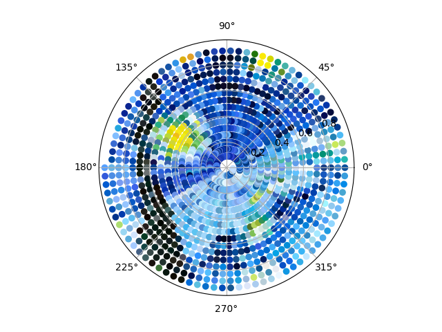
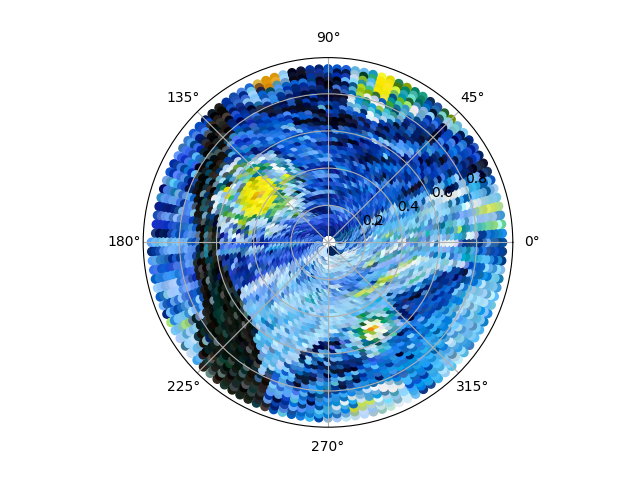

# Lightfield <!-- omit in toc -->
## Unvisualized data in the world around us

Our universe is filled with data. Every raindrop that falls, star that twinkles, or car that moves represents another rich datapoint in our vast and awe-inspiring world. Yet, to the average human onlooker, it's just "random".

Lightfield aims to emphasize this point by presenting artwork stretched along the temporal dimension. A light moves around and changes colors rapidly, following paths with beautiful swirls, arcs, and lines. To a human audience, this looks like a mix between a gracefully choreographed dance and the flashing lights of an airplane passing overhead -- cool and abstract, but not very meaningful.

Yet, from a computational point of view, each infintesimal slice of this movement holds substantial information. By taking a long exposure photograph of the sculpture, one can view the patterns that emerge. What was once some wooden sticks on a can of mixed nuts becomes _Mona Lisa_, or perhaps _The Starry Night_.

# Table of Contents <!-- omit in toc -->
- [Setup](#setup)
  - [Hardware](#hardware)
  - [Mechanical Structure](#mechanical-structure)
  - [ESP32 Wiring](#esp32-wiring)
  - [Common Cathode LEDs](#common-cathode-leds)
  - [Software Dependencies](#software-dependencies)
  - [Installation](#installation)
- [Configuration](#configuration)
  - [What to draw?](#what-to-draw)
  - [Can I draw something myself?](#can-i-draw-something-myself)
  - [Why spirals?](#why-spirals)
- [Photography](#photography)

# Setup
## Hardware
The sculpture contains an ESP32 microcontroller which polls an [external API](https://github.com/mbennett12/kinetic-sculpture-webapi) for a start signal, translates from abstract image representations to physical paths, orchestrates motor movements, and varies the emitted colors. Specifically, a FreeNove ESP32-WROVER-DEV module was used here.

The device also contained a stepper motor driven by a ULN2003 IC, a 9g micro servo, and an RGB LED.

## Mechanical Structure
The enclosure of this device was based on a large cylindrical can, paralleling the radial canvas of the system. However, any hollow container which can be opened will suffice.
1. Drill a hole into the top surface of the container at the center large enough to fit the stepper motor.
2. Insert the stepper motor and drill two additional holes for the mounting points.
3. Thread M3 bolts through the two mounting holes and secure with nuts on the other side.
4. Drill two holes along the "long" axis of a popsicle stick near on end so that the shaft of the stepper motor can be friction fit within.
5. Using the [Servo_Test sketch](Test%20Programs/Servo_Test/Servo_Test.ino), rotate the servo to 180°.
6. Attach a four-pronged servo arm to the servo, but before screwing it in, drill a hole near the end of another popsicle stick and thread the screw through that hole and then into the servo. The stick should be attached so that if it points "down" at 180°, it will point "left" at 90° (the Servo_Test sketch can be modified to validate this).
7. Mount the servo to the unconnnected end of the stepper motor popsicle stick so that at 180°, the popscicle stick of the servo points directly towards the stepper motor shaft.
8. Mount the RGB LED at the unconnected end of the servo motor popsicle stick so that it points upwards. This can be achieved by bending the LED's pins at a 90° angle.
9. Cut a small hole at any point along the upper edge of the cylindrical enclosure to allow wires (for the stepper motor, servo motor, and RGB LED) to pass through.
10. Place a smaller can (or other object) inside of the larger can and place the ESP32 inside the larger can, supported by the smaller can, so that it is oriented vertically.
11. Drill a hole on the side surface near the bottom of the larger can. Pass a USB cable through this hole and connect it to the ESP32.
12. Wire up the electronics as described in [ESP32 Wiring](#esp32-wiring) and then close the enclosure.
   
## ESP32 Wiring
__Stepper Motor__
1. Connect the motor driver's pin IN1 to GPIO 14.
2. Connect the motor driver's pin IN2 to GPIO 27.
3. Connect the motor driver's pin IN3 to GPIO 26.
4. Connect the motor driver's pin IN4 to GPIO 25.
5. Connect the stepper's pins A-D to the motor driver's pins A-D, matching the respective letters.
6. Connect the stepper's PWR pin to the motor driver's PWR output pin.
7. Connect the motor driver's GND to the ESP32's GND.
8. Connect the motor driver's VCC and PWR input pins to a 5V source (with common ground between that source and the ESP32).

__Servo Motor__

_Note that sufficiently long wires (on the order of two popsicle stick lengths) should be used to connect the servo motor and the RGB LED to the ESP32 so as to allow connections to remain intact at the furthest extent of the movement range._
1. Connect the servo's VCC line to a 5V source.
2. Connect the servo's GND line to that source's GND (common with the ESP32's supply).
3. Connect the servo's Signal line to GPIO 15 on the ESP32.
4. Connect a large capacitor (for example, 1000 µF) across the power supply near where the servo's VCC and GND lines are connected. This helps to stabilize the voltage during bursts of current draw, preventing servo buzz.

__RGB LED__

_Note that a common anode RGB LED was used. See [Common Cathode LEDs](#common-cathode-leds) below for common cathode LED usage instructions._
1. Connect the common anode to a 3.3V supply.
2. Connect the red LED cathode to GPIO 33 through a 220 Ω resistor.
3. Connect the green LED cathode to GPIO 32 through a 220 Ω resistor.
4. Connect the blue LED cathode to GPIO 4 through a 220 Ω resistor.

## Common Cathode LEDs
To connect a common cathode RGB LED:
1. Connect the common cathode to GND.
2. Connect the red LED anode to GPIO 33 through a 2.2 kΩ resistor.
3. Connect the green LED anode to GPIO 32 through a 2.2 kΩ resistor.
4. Connect the blue LED anode to GPIO 34 through a 2.2 kΩ resistor.
5. Modify the `setColor` function in `ESP32/Lightfield/Lightfield.ino` as follows:

        void setColor(byte r, byte g, byte b) {
            r *= BRIGHTNESS;
            g *= BRIGHTNESS;
            b *= BRIGHTNESS;
            ledcWrite(pwmCh[0], r);
            ledcWrite(pwmCh[1], g);
            ledcWrite(pwmCh[2], b);
        }

## Software Dependencies
- Arduino 1.8.13 (or similar)
  - ESP32Servo library
- Python 3.9
  - Matplotlib
  - PIL

## Installation
1. Create a file in `ESP32/Lightfield/` called `secrets.h` containing the following code (with the appropriate credentials inserted):

        const char *wifi_ssid = "YOUR_WIFI_SSID";
        const char *wifi_password = "YOUR_WIFI_PASSWORD";

2. Upload the [sketch](ESP32/Lightfield/Lightfield.ino) to your ESP32.

# Configuration
## What to draw?
A premade sketch to draw a portion of the _Mona Lisa_ is provided [here](ESP32/Lightfield_MonaLisa.ino). Alternatively, select an image and place it in the `Artwork/` folder, then modify [`Artwork/convert_to_polar.py`](Artwork/convert_to_polar.py) with the appropriate `FILE_PATH`. Increasing `NUM_POINTS` and decreasing `ANGULAR_SPACING` will increase the quality of the resultant image, but will result in a longer-duration image path (see [Photography](#photography) for details).

 Run that Python script and the output will be placed in `Artwork/artwork.h`. A preview of the converted image will also be shown. Sample outputs are shown below, with one generated using `NUM_POINTS=1500` and `ANGULAR_SPACING=4` and the other generated using `NUM_POINTS=3000` and `ANGULAR_SPACING=3`.
 

 Copy the `artwork.h` file into `ESP32/Lightfield/`, replacing the preexisting file and then follow the instructions in [Installation](#installation) to upload the new artwork onto the device.

## Can I draw something myself?
Of course! A web app is provided in `Web/` which can be accessed by opening [`Web/Index.html`](Web/Index.html) in your web browser of choice. Click within the circular field to draw and click along the color slider to change the brush color. Then, right click and save the image. Follow the instructions in [What to draw?](#what-to-draw) to prepare your drawing for the Lightfield.

## Why spirals?
The Lightfield artwork upload code is programmed to move in a spiral so that the choreography appears orderly yet decoupled from the final result to human viewers. However, the Lightfield is actually capable to more complex pathing such as linear motion. For example, the following code can be placed in the `loop` function of the `Lightfield.ino` sketch to draw a straight line:

    for (float i = 0.1; i < 1.0; i += 0.01) {
        move_to_polar(i, 35);
        delay(50);
    }

However, it was a key decision that the Lightfield draws along the spiral, changing colors rapidly, rather than drawing one color at a time. Doing so disconnects the temporal behavior of the Lightfield from that of the artist and their brushstrokes.

# Photography
For best results, photograph the Lightfield in a dark setting with a professional camera. Set the ISO to a minimum, use the Time or Bulb shutter speed setting, and minimize the aperture. If the result is overexposed, try compensating for exposure in the camera settings and decreasing the `BRIGHTNESS` parameter in `Lightfield.ino`. A neutral density filter can also help alleviate overexposure issues. Keep in mind that higher-resolution image paths will take longer to complete, and thus require more compensation to prevent overexposure.